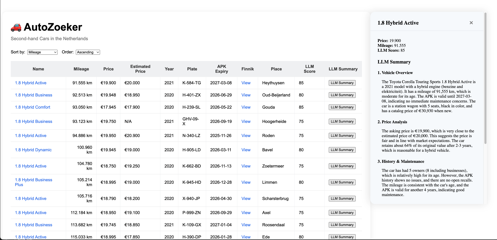

# 🚗 AutoZoeker - Personal Car Intelligence Assistant

A personal automation tool that aggregates car information from Dutch car websites and uses AI to help make informed purchasing decisions. Built for my own car shopping needs, AutoZoeker combines web scraping, data enrichment, and LLM consultation to analyze car listings and provide intelligent insights.

## 📸 Screenshot



## Features

- **Automated Data Collection**: Scrapes car listings from Gaspedaal.nl to save manual browsing time
- **Smart Data Enrichment**: Automatically adds ANWB price estimates and detailed specs from Finnik
- **AI-Powered Analysis**: Consults DeepSeek LLM to evaluate each car's value proposition and condition
- **Personal Dashboard**: Clean React interface for reviewing and comparing analyzed cars
- **Customizable Criteria**: Easy to modify search parameters for different car preferences

## Development Setup

### Backend
```bash
cd backend
npm install
npm run dev
```

### Frontend  
```bash
cd frontend
npm install
npm run dev
```

### Scraper
```bash
cd scraper
pip install -r requirements.txt
python main.py scrape normalize
```

## How It Works

This personal automation pipeline saves hours of manual car research:

1. **Automated Scraping** - Fetches listings from Gaspedaal.nl based on my criteria
2. **Data Enrichment** - Adds ANWB price estimates and detailed specs from Finnik  
3. **LLM Consultation** - DeepSeek AI evaluates each car's value, condition, and potential issues
4. **Personal Dashboard** - Backend API serves processed data to a React frontend
5. **Informed Decisions** - Review AI insights and compare cars to make better purchasing choices

## Configuration

Personal setup notes:

- Update cookies in `scraper/main.py` monthly for Gaspedaal access
- Set DeepSeek API key in `.env` for AI analysis features  
- Modify search URL in `main.py` to change car search criteria
- Adjust LLM prompts in `llm.py` to customize analysis focus
